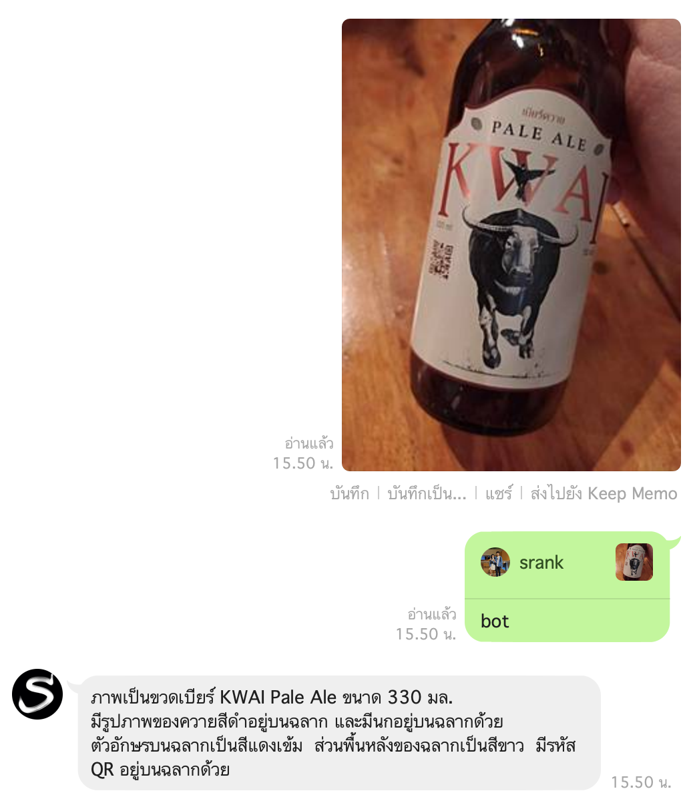
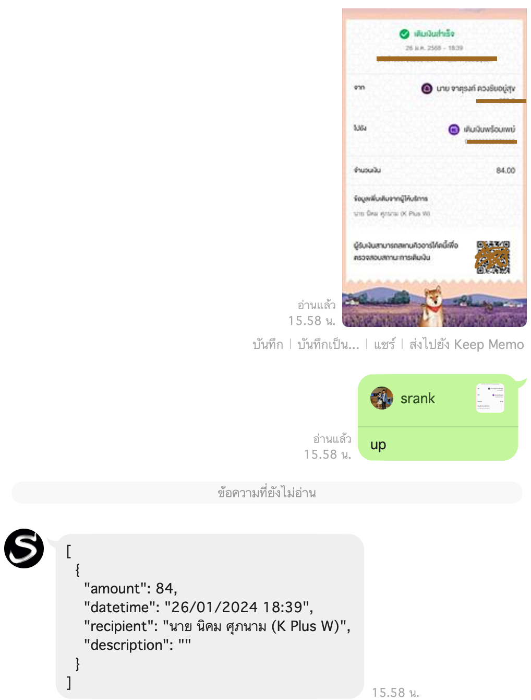
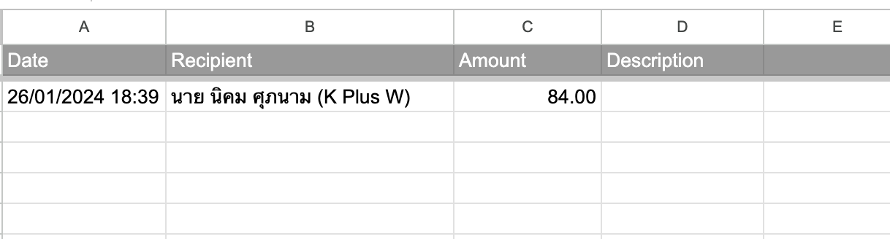

# srank-assistance

The AI assistance for srank

- Any question can be chat with this bot
- Upload the receipts for ***auto*** monthly expenses record to google sheet

## Line chat bot

Implement with firebase google cloud function

Setup steps can be found at [README](src/firebase-cloud-function/README.md)

### Usecases

#### Simple chat with text

Type plain text that include "***bot***" sent to chat, e.g. "bot ประเทศไทยมีกี่จังหวัด"

> 

#### Describe photo in chat

Uplaod the image in chat, then qouted the image and type "***bot***" sent to chat

> 

#### Upload receipt

Uplaod the receipt in chat, then qouted the image and type "***up***" sent to chat

> 

Then, Append the data to google sheet automatically.
> 

## Local LLM Chat API

The API implement with python flask and ollama.

Setup steps can be found at [README](src/local-llm/README.md)

Run curl

```sh
curl --location 'http://localhost:5000/chatbot' \
--header 'Content-Type: application/json' \
--data '{
    "message": "ประเทศไทยมีกี่จังหวัด"
}'
```
